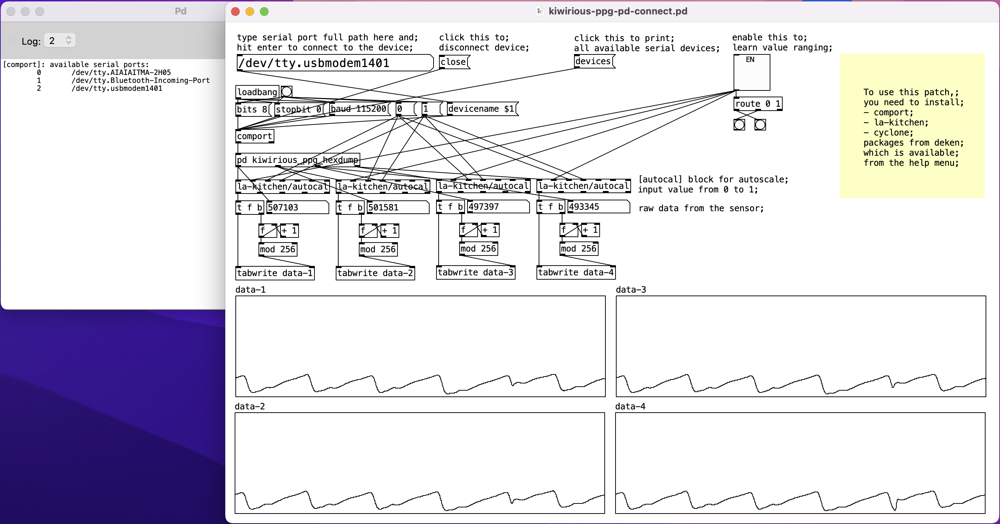

# kiwirious_ppg_maxpd_example is example patch files for MaxMSP and PureData to access kiwirious sensor.

## what you need
- kiwirious PPG sensor
that's it!

## MaxMSP example
[MaxMSP](https://cycling74.com/) is a node-based programming environment which is beloved by audio community worldwide for their creation. It is a share-ware, however, very reliable programming environment.

In the example, we have two patches: `__SERIAL__.maxpat`, which is a small patch to make serial device access in Max easier and will be called in the main patch as a bpatch object, and `kiwirious_ppg_test.maxpat`, which is the main patch comes with a data plotter.
Open the `kiwirious_ppg_test.maxpat` to see the window as mentioned in the screenshot above. First, you click the right top round button to refresh the serial device list in the dropdown menu.
Once you picked the device ID, you click the open button to connect to the device. After that, you can click the big button on the left top corner to start reading the data.

## PureData example
[PureData](https://puredata.info/), on the other hand, is a freeware originally developed by Miller Puckette and sharing the same roots with MaxMSP. You can download the software from the official website or their [GitHub repo](https://github.com/pure-data/pure-data) or even a package manager on your OS (apt, homebrew, etc...).

PureData (Pd) has its own package manager called `deken`. To use the bundled patch `kiwirious-ppg-pd-connect.pd`, you need to install three packages:
- comport
- la-kitchen
- cyclone

You can find the `deken` menu from the help option in the menu bar, and you can search each of them at one time from the search bar so that you can install one by one.
Once you open the patch, you can click the button on the top part of the patch says "devices" to print all available serial ports in the log window. Then you need to type the full serial port name to the textbox on the top left corner. Once you hit the enter key after that, the patch will be conencted to the device.

You will soon start to see the four plot boxes in the bottom half of the patch start plotting the incoming signal. when you see the amplitude of the signal in the plot is not enough or invisible, you can click the box button on the top right hand side to let the patch learn the auto signal scaling range. After sometime, you will start to see the plot will be adjusted to the incoming signal and will be able to see a clear signal.

### tested platforms, developer, license
- Platforms
macOS 12.3, MaxMSP 8.2.2, Pd0.52-2

- developer
Ryo Hajika (Empathic Computing Laboratory, The University of Auckland / Research Unit "imaginaryShort")

- Licence
TBD
